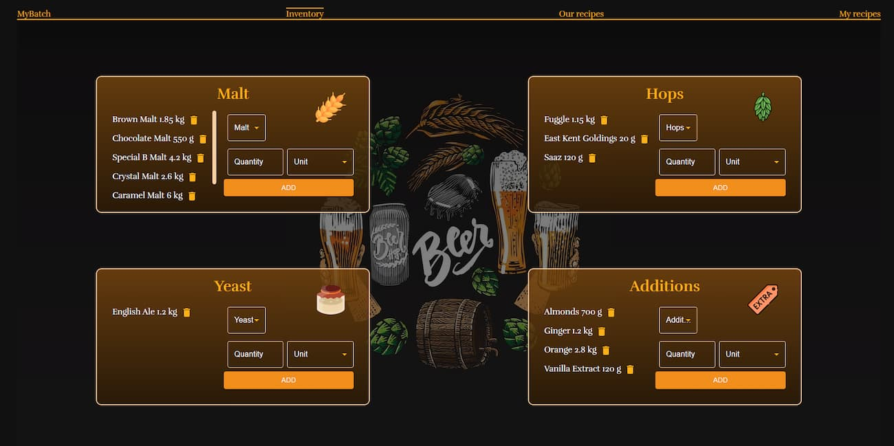
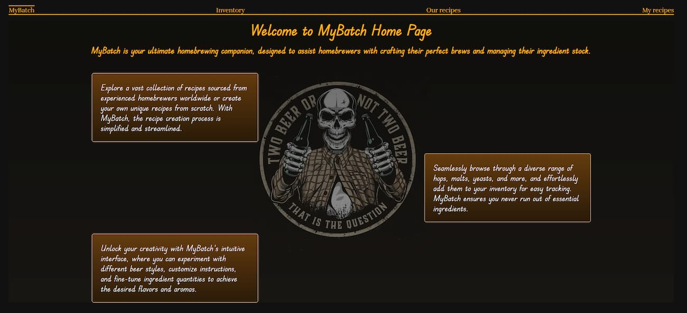
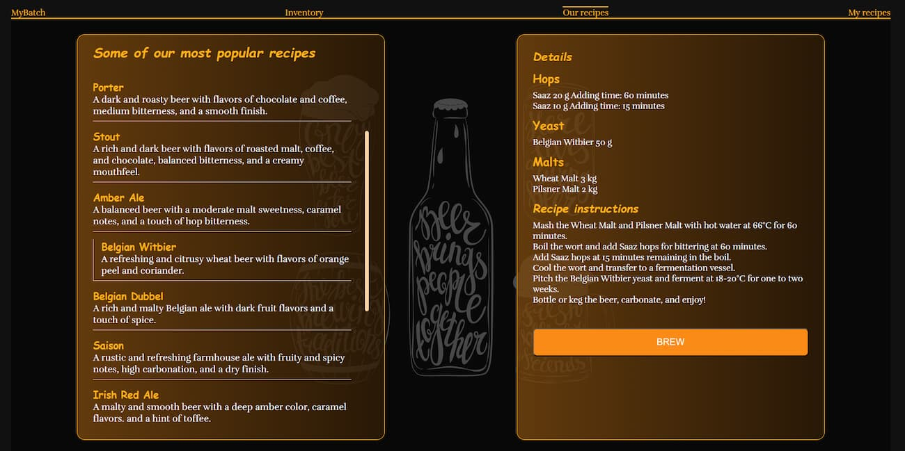
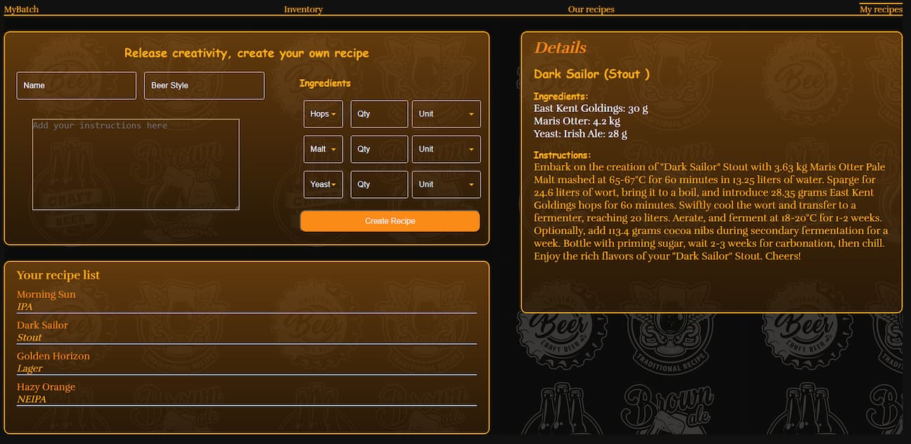

# MyBatch

MyBatch is a brewing management system that helps homebrewers organize and track their beer recipes, ingredients, and brewing processes. This project is designed to facilitate the brewing experience by providing a user-friendly interface and essential features for managing brewing recipes and inventory.

## Features

- **Recipe Management:** Create, view, and manage your brewing recipes.
- **Ingredient Tracking:** Keep track of your inventory and ingredients.
- **Brewing Process:** Record and monitor the brewing process for each recipe.
- **Inventory Reduction:** Automatically update your ingredient inventory when brewing.

## Screenshots

## Tech Stack

    **MERN**

<b>FrontEnd<b/>: React, Material UI, CSS, Jest  
<b>BackEnd<b/>: Node.js, Express **MVC**  
<b>Database<b/>: MongoDB, Mongoose

## Getting Started

To get started with MyBatch, follow these steps:

1. **Clone the Repository:**

2. **npm install **

3. **npm start to start client, server node.js to start the server **

4. ** Please populate ourRecipes collection with recipes.json **
